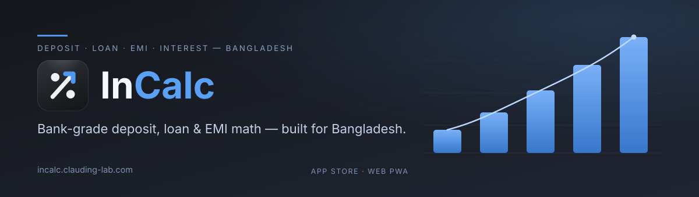
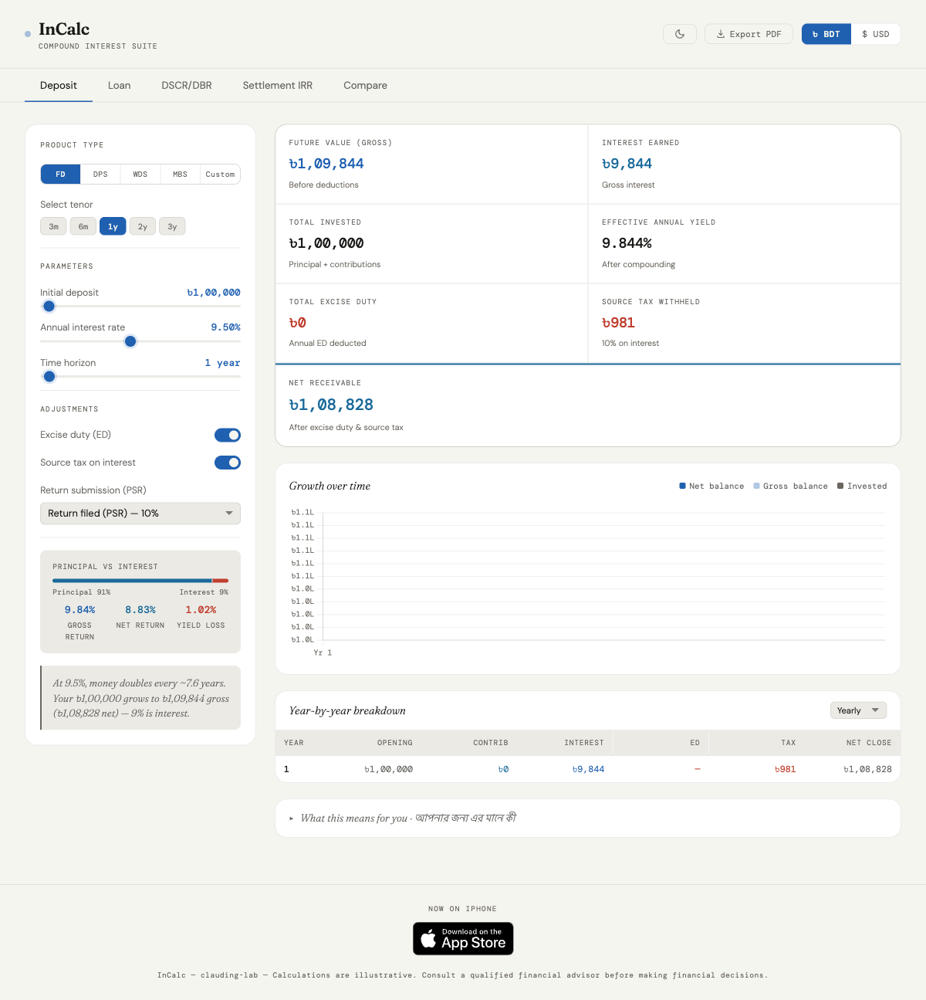
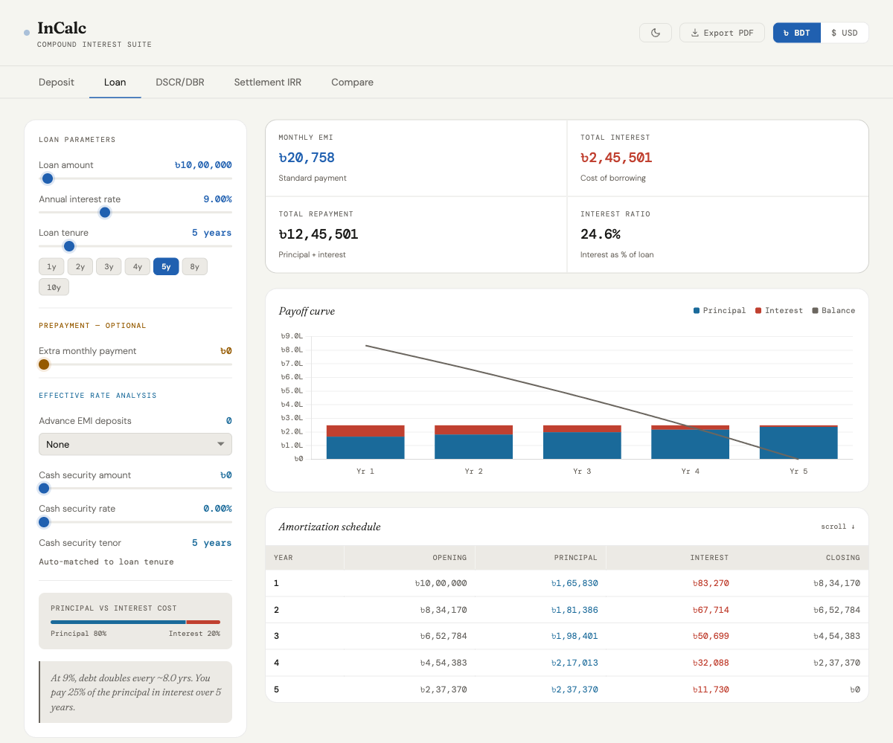

<div align="center">

<a href="https://incalc.clauding-lab.com"></a>

# InCalc — Banking Calculator Suite

**Bank-grade deposit, loan & EMI maths for Bangladesh — on the web and on iOS.**

[**Open the web app →**](https://incalc.clauding-lab.com)

<a href="https://apps.apple.com/app/id6780260202"></a>

**Web v1.1.2** · **iOS InCalc BD v1.1.1** — [Releases](https://github.com/clauding-lab/interest-calc/releases)

</div>

---

## What it is

InCalc is a single-file, offline-capable web app of banking calculators built for **Bangladesh banking practice** — deposit interest with NBR excise duty and source tax, loan EMI and amortization, debt-service ratios, settlement XIRR, and side-by-side scenarios. There's no build step, no backend, and no tracking: open `index.html` and it works.

The same calculators ship as a native SwiftUI iOS app, **InCalc BD** (iPhone, iOS 17+, free), kept number-for-number identical to the web app through a shared golden-vector test contract.

It's built by a banker for the people who need the *local* numbers right — the excise-duty slabs, source-tax rules, profit-rate conventions, and tenor maths that generic calculators quietly get wrong.

> **Wrong financial output is the worst possible defect.** Calculations are golden-vector-locked and follow NBR/IDLC product conventions — but see the [disclaimer](#disclaimer).

## Calculators

| Tab | What it does |
|---|---|
| **Deposit** | Interest projection for **FD, DPS, WDS, MBS and Custom** deposits, with NBR excise duty and source tax (TDS) deductions, effective annual yield, a year-by-year breakdown, and a final **net-receivable** figure. |
| **Loan** | EMI, total interest, full **amortization schedule**, prepayment savings, and an effective-rate analysis for advance EMIs / cash security. |
| **DSCR / DBR** | Debt-service coverage and debt-burden ratios from an income statement plus existing and proposed obligations, with an IRR-based effective rate. |
| **Settlement IRR** | XIRR on a loan settlement: import the working **Excel** file (or start blank), enter receivables / waivers and the payment schedule, and get the annualized return. |
| **Compare** | Two deposit or loan scenarios side by side. |

## Screenshots

<div align="center">

&nbsp;&nbsp;

</div>

## Features

- 🇧🇩 **Bangladesh-correct by default** — NBR excise duty charged on each year's gross balance, source tax (TDS) at 10% / 15% depending on PSR return-filing status, applied as mandatory deductions.
- 📊 **Visual results** — growth-over-time charts, a principal-vs-interest split, and a year-by-year breakdown table (week-by-week for the WDS weekly-deposit scheme).
- 🗣️ **Plain-English + বাংলা explainers** — a "What this means for you · আপনার জন্য এর মানে কী" note under every result, so the numbers actually make sense.
- 💱 **BDT ⇄ USD display toggle** — all maths runs in BDT; the currency switch only converts at the display layer.
- 🌙 **Light / dark theme.**
- 📄 **Export to PDF** / print-friendly layouts for sharing or filing.
- 📲 **Installable PWA** — add to home screen; works offline after the first load (the core calculators always; charts and Excel import once their CDN assets have cached).
- 🔒 **100% client-side** — no backend, no accounts, no tracking. Your numbers never leave your device.

## Get it

| Platform | |
|---|---|
| **Web** | [incalc.clauding-lab.com](https://incalc.clauding-lab.com) — installable PWA, works offline |
| **iOS** | [InCalc BD on the App Store](https://apps.apple.com/app/id6780260202) — native SwiftUI, iPhone, iOS 17+, free |

## Tech

- One `index.html` (markup + CSS + JS inline). No framework, no bundler.
- `sw.js` — service worker (network-first for the page, cache-first for assets) makes it an installable, offline-capable PWA.
- `manifest.json` + icons — PWA shell.
- Two CDN libraries, pinned with Subresource Integrity: **Chart.js 4.4.1** (charts) and **SheetJS 0.20.3** (Excel import on the Settlement tab).

## Running locally

The service worker needs `http(s)`, not `file://`:

```sh
ruby -run -ehttpd . --port=8080   # then open http://localhost:8080
# or: python3 -m http.server 8080
```

## Regulatory values

Tax rates, the processing-fee rate, and the display FX rate live in one `CONFIG` block near the top of the `index.html` script. Excise-duty slabs live in `getED()` with a fiscal-year comment — they currently reflect **FY2026-27** (excise-duty exemption ৳4,00,000; source tax 10% with PSR / 15% without). **Re-check both after every Bangladesh national budget.**

## Disclaimer

Calculations are illustrative. Verify against official figures and consult a qualified advisor before relying on any output for a real decision.

## License

MIT — see [LICENSE](LICENSE).
